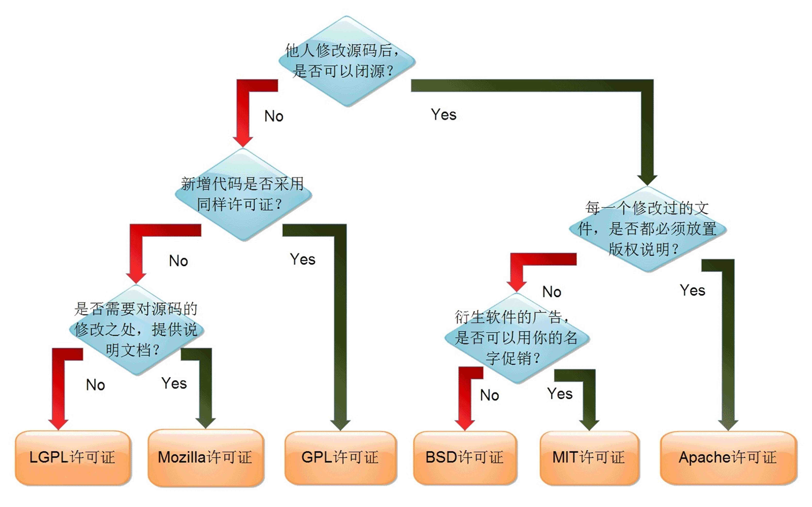
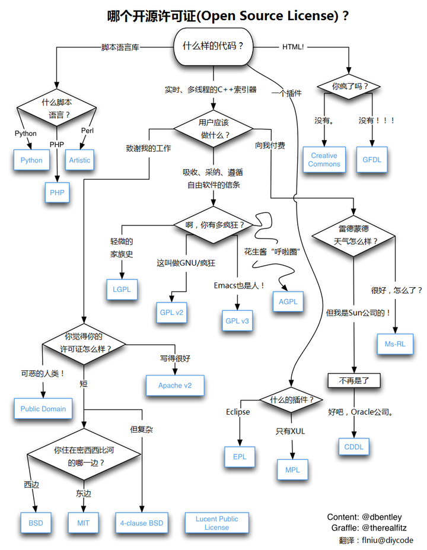

# Public License List

罗列各种开源代码的公共协议以供选择。具体每一个协议的含义可以另外找教程文章或看官网原文，这里解决“都有什么”的问题。

List of licenses that can be chosen.

------

## 杂项

-   这是一篇不错的介绍开源协议的文章

    [当你决定把代码开源之前先选择一个合适的 License](https://zhuanlan.zhihu.com/p/24575976)

-   这是一个开源协议选择器

    [public-license-selector](https://github.com/ufal/public-license-selector)——Tool that will help you select the right open license for your data or software

-   关于 CC 协议的详细介绍

    [CC 协议使用 FAQ](https://zhuanlan.zhihu.com/p/22320679)
    
    [所有 Creative Commons 协议的罗列和选择](https://creativecommons.org/licenses/)
    
    [知识共享@中国大陆 - 知识共享中国大陆项目官方网站 (creativecommons.net.cn)](http://creativecommons.net.cn/)

## 正经的（Official）

|License name | URL |
|-------------|-----|
| **Affero General Public License 3 (AGPL-3.0)** | http://opensource.org/licenses/AGPL-3.0 |
| Apache License 2 | http://www.apache.org/licenses/LICENSE-2.0 |
| Artistic License 1.0 | http://opensource.org/licenses/Artistic-Perl-1.0 |
| Artistic License 2.0 | http://opensource.org/licenses/Artistic-2.0 |
| Common Development and Distribution License (CDDL-1.0) | http://opensource.org/licenses/CDDL-1.0 |
| Creative Commons Attribution (CC-BY) | http://creativecommons.org/licenses/by/4.0/ |
| Creative Commons Attribution-NoDerivs (CC-BY-ND) | http://creativecommons.org/licenses/by-nd/4.0/ |
| Creative Commons Attribution-NonCommercial (CC-BY-NC) | http://creativecommons.org/licenses/by-nc/4.0/ |
| Creative Commons Attribution-NonCommercial-NoDerivs (CC-BY-NC-ND) | http://creativecommons.org/licenses/by-nc-nd/4.0/ |
| **Creative Commons Attribution-NonCommercial-ShareAlike (CC-BY-NC-SA)** | http://creativecommons.org/licenses/by-nc-sa/4.0/ |
| Creative Commons Attribution-ShareAlike (CC-BY-SA) | http://creativecommons.org/licenses/by-sa/4.0/ |
| Eclipse Public License 1.0 (EPL-1.0) | http://opensource.org/licenses/EPL-1.0 |
| GNU General Public License 2 or later (GPL-2.0) | http://opensource.org/licenses/GPL-2.0 |
| GNU General Public License 3 (GPL-3.0) | http://opensource.org/licenses/GPL-3.0 |
| GNU Library or "Lesser" General Public License 2.1 or later (LGPL-2.1) | http://opensource.org/licenses/LGPL-2.1 |
| GNU Library or "Lesser" General Public License 3.0 (LGPL-3.0) | http://opensource.org/licenses/LGPL-3.0 |
| Mozilla Public License 2.0 | http://opensource.org/licenses/MPL-2.0 |
| Public Domain Dedication (CC Zero) | http://creativecommons.org/publicdomain/zero/1.0/ |
| Public Domain Mark (PD) | http://creativecommons.org/publicdomain/mark/1.0/ |
| The BSD 2-Clause "Simplified" or "FreeBSD" License | http://opensource.org/licenses/BSD-2-Clause |
| The BSD 3-Clause "New" or "Revised" License (BSD) | http://opensource.org/licenses/BSD-3-Clause |
| **The MIT License (MIT)** | http://opensource.org/licenses/mit-license.php |

## 开源协议的选择

### CC 协议

对于非编程代码的个人作品如图片、文字等可选择使用 CC 协议。

都有什么：[About CC Licenses - Creative Commons](https://creativecommons.org/about/cclicenses/)。

在每个协议页面下面有 [use the license](https://creativecommons.org/choose/results-one?license_code=by-nc-sa&jurisdiction=&version=4.0&lang=zh)（这个以 CC BY-NC-SA 为例），点进去可以获得该协议的图标，可以加到 个人作品 中 表示 使用该协议，他人使用您的作品需要遵守该协议的规则。

### 对几个常用开源协议的简短说明

- AGPL-3.0：

  > 引自 [AGPL 开源授权协议_cnhome的博客-CSDN博客_agpl](https://blog.csdn.net/cnhome/article/details/118650665)，[GPL和AGPLv3的区别_KeepLearningBigData的博客-CSDN博客_agpl gpl](https://xubo245.blog.csdn.net/article/details/47278403)。
  >
  > AGPL = GPL + 一条限制。
  >
  > - GPL：如果你使用的GPL的代码作为基础完成你自己的软件，如果你要分发你的软件，你的软件必须也是GPL的。如果使用GPL成分的软件通过互联网或者其他方式发布，就必须提供源代码。
  > - 一条限制：如果使用AGPL许可的软件与用户通过网络进行交互，也需要提供源代码给用户，所有的修改也要给用户。
  >
  > GPL 和 AGPLv3 的区别：
  >
  > - GPL v3 协议，意味着修改和使用其代码都需要开源，但是这是建立在软件分发的基础上，如果使用代码作为服务提供，而不分发软件，则不需要开源。这实际上是 GPL 协议本身的缺陷。
  > - AGPL v3 协议，也就是说，除非获得商业授权，否则无论以何种方式修改或者使用代码，都需要开源。

- MIT：限制几乎是最少的开源协议。

  > 引自 [MIT开源协议_yanqing0924的博客-CSDN博客_mit开源协议](https://blog.csdn.net/yanqing0924/article/details/6111420)。
  >
  > - 被授权人权利：被授权人有权利使用、复制、修改、合并、出版发行、散布、再授权及贩售软件及软件的副本；被授权人可根据程序的需要修改许可协议为适当的内容。
  > - 被授权人义务：在软件和软件的所有副本中都必须包含版权声明和许可声明。
  > - 其他重要特性：此许可协议并非属copyleft的自由软件许可协议，允许在自由及开放源代码软件或非自由软件（proprietary software）所使用；MIT的内容可依照程序著作权者的需求更改内容，此亦为MIT与BSD（The BSD license, 3-clause BSD license）本质上不同处；MIT许可协议可与其他许可协议并存，另外，MIT条款也是自由软件基金会（FSF）所认可的自由软件许可协议，与GPL兼容。

- CC-BY-NC-SA 4.0：

  > 引自 [YunYouJun/yun: ☁️ 小云设定资源大公开！ (github.com)](https://github.com/YunYouJun/yun)。
  >
  > 简而言之，在非商业使用与署名（发布时注明原设出处即可）的前提下，您可以任意对其进行修改（包括但不限于 P 图、二次创作）、印刷、分发等。

### 其它更多协议的详细描述

[开源软件许可协议介绍_Dave888Zhou的博客-CSDN博客_gpl开源协议](https://blog.csdn.net/zhoudaxia/article/details/8044129)。

[详细介绍六种开源协议（程序员须知） - 知乎 (zhihu.com)](https://zhuanlan.zhihu.com/p/136809734)。

### 用图描述开源协议的选择

下图出处：乌克兰程序员 Paul Bagwell 画了一张分析图（图为阮一峰汉化版 http://www.ruanyifeng.com/blog/ Cc-By-3.0 / 2011.5.2）

下图出处：见图中右下角

## 感动的（Be moved）

[“**良心授权**” 协议](https://github.com/wmjordan/PDFPatcher)：

> 本软件对于最终用户免费。由于本软件使用了带有 AGPL 条款的第三方开源组件，因此，本软件及其源代码的使用协议也基于 AGPL。另外还带有如下附加条件。在遵守本软件的前提条件下，你可以在遵循本协议的基础上自由的使用和传播它，你一旦安装、复制或使用本软件，则表示您已经同意本协议条款。如果你不同意本协议，请不要安装使用本软件，也不应利用其源代码。
>
> 附加条件： 每一个使用本软件的用户，如果本软件帮助了您，每使用本软件后，您应当做 1 件善事。善事无分大小，有心则行。例如：
>
> 1. 如果您的父母在身边，你可以为您的父母做一顿美味的饭菜，或者为他们按摩、洗脚；如果他们身处远方，你可以向他们发起通话，问候他们的健康和生活。
> 2. 在大雨滂沱的时候，如果您有雨伞，可与同路的人共享；在烈日当空的时节，如果您看到环卫工人太阳下工作，您可以为他们买一瓶水送给他们；在拥挤的公共交通工具上，或在公共场合排队等候之际，如果您有座位，可以让给老人、孕妇或提着重物的人就坐。
> 3. 您可以用您擅长的技能，为身边的人排难解困；您可以将您的知识，分享给其他人，让他们有所获益；您可以向比您困难的人捐资赠物。
> 4. 如果您觉得这个软件真的好用，请将它的使用方法介绍给别人，让别人也通过使用本软件而得到好处；或者将其它您觉得好用的软件介绍给别人。
>
> 如果您无法做到使用本软件后做 1 件善事，请记在心中。在有机会的时候，多行善积德。本用户协议之遵循与否，全在于您的良心。是为“**良心授权**”。

## 不正经的（Unofficial）

| License name                                    | URL                                                          |
| ----------------------------------------------- | ------------------------------------------------------------ |
| "Good Luck With That" Public License            | https://github.com/me-shaon/GLWTPL                           |
| DO WHAT THE FUCK YOU WANT TO PUBLIC LICENSE     | https://github.com/anak10thn/WTFPL                           |
| Dont Be a Dick Public License                   | https://github.com/philsturgeon/dbad                         |
| The Sandia Message Public License               | https://github.com/cdanis/sandia-public-license              |
| SAY NO TO SUICIDE PUBLIC LICENSE                | https://github.com/unbug/snts                                |
| The Star And Thank Author License(SATA License) | https://github.com/zTrix/sata-license；一篇中文介绍：[SATA License——开源的泥石流](https://blog.csdn.net/qq_30242609/article/details/54835687) |
| etc.                                            |                                                              |
|                                                 |                                                              |
|                                                 |                                                              |

